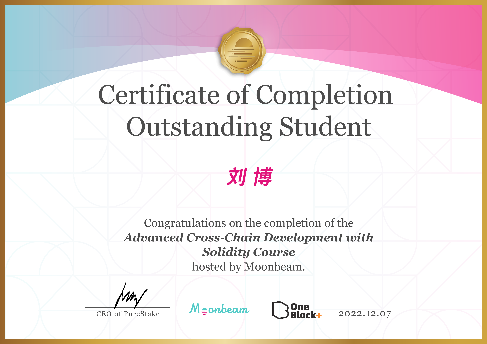

<!-- markdownlint-disable MD041 MD010 MD033 -->
# blockchain

Learning notes and sample codes about blockchains

## Books

* [Bitcoin development philosophy](https://bitcoindevphilosophy.com/)

## NFTs

* <https://yumi.io/market/nft-detail/3bag5-taaaa-aaaah-adoka-cai/1>

## Certificates

想参加相关课程的可以扫码报名，完成作业后达到优秀，会全额退款，以及可以获得证书，以及申请 Substrate 技术大使等。

 

 

 

 

 

 

 

 

 

 

 

 

