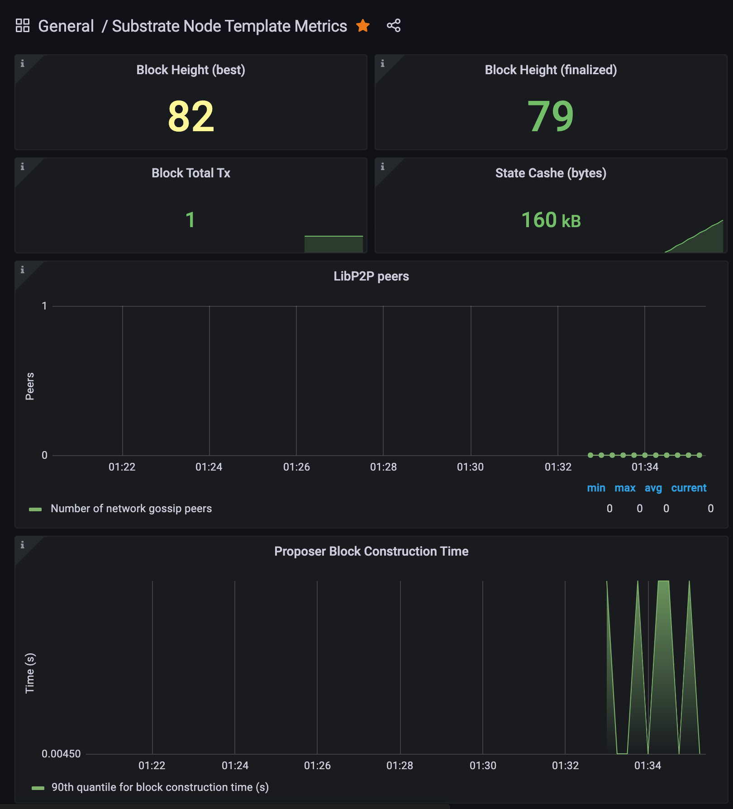

# prometheus 配置

## Overview



## Tutorial

* <https://docs.substrate.io/tutorials/v3/node-metrics/>

## Metrics data
* [substrate-utils-prometheus](https://github.com/paritytech/substrate/tree/master/utils/prometheus)

## Grafana Dashboards

* [Substrate node template metrics](https://grafana.com/grafana/dashboards/13759)
* [substrate-node-template-metrics.json](https://docs.substrate.io/assets/tutorials/node-metrics/substrate-node-template-metrics.json)

## Configs

`/usr/local/etc/prometheus.args`

```
--config.file /usr/local/etc/prometheus.yml
--web.listen-address=0.0.0.0:9090
--storage.tsdb.path /usr/local/var/prometheus
--storage.tsdb.retention.time=1d
```

`/usr/local/etc/prometheus.yml`

```
global:
  scrape_interval: 15s

scrape_configs:
  - job_name: "prometheus"
    static_configs:
    - targets: ["localhost:9090"]
  - job_name: "substrate_node"
    scrape_interval: 5s
    static_configs:
      - targets: ["localhost:9615"]
```
