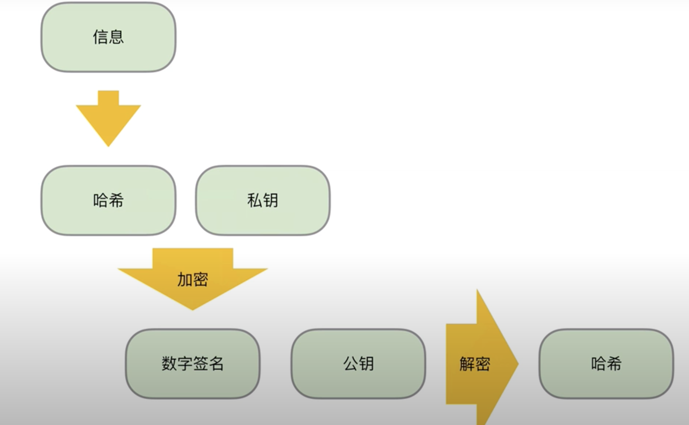

# 比特币白皮书详解

## 白皮书地址

* [英文](https://bitcoin.org/bitcoin.pdf)
* [中文](https://bitcoin.org/files/bitcoin-paper/bitcoin_zh_cn.pdf)

从现在的时间点来读比特币白皮书，更多的是回顾一下比特币的历史，因为比特币的技术现在已经是个区块链的基础，基本大家都能有所了解。读懂比特币白皮书还是需要一定的背景知识的，因为白皮书本身的文字还是有点晦涩难懂，其实个人觉得看个大概就行了，把里面的精髓吸收了就 OK 了。

## 比特币是什么？

从白皮书上看，给出的明确答案是去中心化的电子现金系统，有共识的 P2P 网络，和不受少数人控制的平台。白皮书除了摘要，简介和总结，还有 10 个部分。

## 理解比特币

### 去中心化的电子现金系统

去中心化意味着可以不经过中介直接给对方转账。而传统的转账是需要经过可信第三方或者金融机构的，如：银行或者支付宝，微信这个的比较有公信力的组织。而比特币这个协议可以让互联网上的两个人不经过中介直接进行转账。比特币是货币，而比特币系统是账本。而这个账本的名字就叫区块链。
想要理解比特币的底层原理，需要阅读白皮书的第二节交易以及第九节价值的组合与分割。而防止比特币双花，需要先明确交易的先后顺序，也就是第三节时间戳服务器，实现了交易的排序。第八节简化支付验证就是在移动端等小型设备不希望下载整个区块账本数据，来验证一笔交易，也就是手机钱包软件所要用到的技术。

### 有共识的 P2P 网络

在有一个中心化中介的系统里，维护一个账本是比较简单的。而在各个节点都对等的 P2P 的网络上，账本的不可篡改和唯一性只能通过共识来达成。比特币的共识机制会保证大部分人会保持诚实，大部分人认可的账本会同步到所有节点。而攻击者所篡改的账本会被网络淘汰。共识的达成是通过第四节工作量证明的机制，共识机制是比特币安全的核心。攻击者如有过足够的算力 (超过全网算力 50%) 是可以对比特币系统造成攻击的。第 11 节计算是详细介绍了攻击成功的概率是如何计算的，从而可以看出整个系统是有非常强的抗攻击能力的。

比特币网络的物理实体是安装了比特币客户端的各个节点。比特币客户端的代码是开源透明的，白皮书的各个规则是靠各个客户端的平等协作来完成的，网络的运行过程在第五节网络中有详细介绍。节点要保存完整的账本就需要非常大的磁盘空间，第七节回收硬盘空间介绍了哪些数据是可以删除的。

### 不受少数人控制的平台

比特币是一个自我激励的系统，保证了比特币系统的运行不需要个人或其他机构进行投资与控制。系统的使用者同时就是贡献者，贡献者可以获得激励来补偿硬件和电力的成本。第六节激励就详细介绍了激励的具体形式。第十一节隐私保证了比特币的自由，介绍了比特币如何隐藏使用者的身份。比特币的创新与发展不需要一个中心机构进行审批，这样创新的速度就会提高。

## UTXO

```
UTXO = Unspent Transaction Output
余额 = 交易输出 - 已花费
```

比特币的大账本并没有直接记录每个地址的余额， 而是记录了历史上所有的交易。而每个地址的余额实际上是软件帮我们算出来的。有种说法，比特币就是 UTXO.

## 认证转账人身份



数字签名可以解决确认转账人身份的问题，但是不能解决双花问题。

## 防止双花

这部分是白皮书的核心内容。一个是交易排序 (时间戳服务器)，一个是防止篡改 (POW 共识机制)。

中心化的时间戳服务器，一般是比较有公信力的服务器，有法律效力。交易本身不包含时间戳。区块时间戳的时间是大概时间。参考[Block Timestamp](https://en.bitcoin.it/wiki/Block_timestamp) 比特币没有采用时间戳来对交易进行排序，而是靠区块链区块的顺序来对交易进行排序。