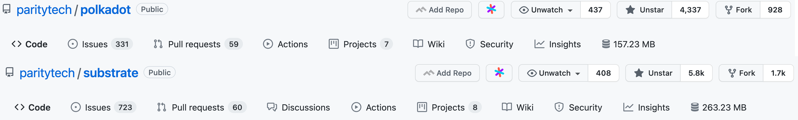
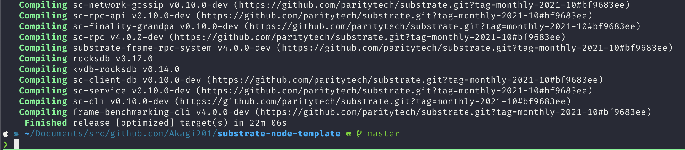
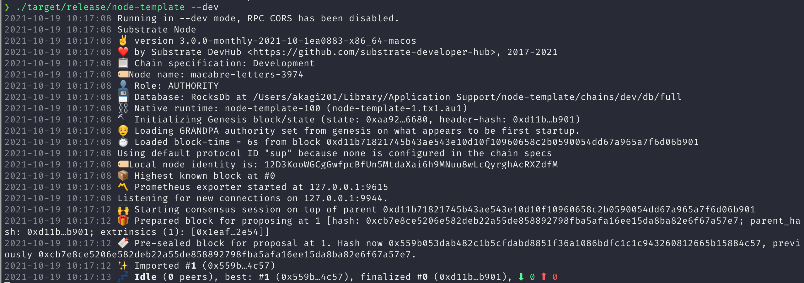

# solution02

1) Substrate 的官方文档网址是什么？
  > <https://docs.substrate.io/>

2）Substrate 的 recipe 网址是什么？
  > <https://docs.substrate.io/how-to-guides/v3/>

3）Substrate 的 rust docs 的网址是什么？
  > <https://docs.substrate.io/rustdocs/>

4）Substrate 的 tutorial 的网址是什么？
  > <https://docs.substrate.io/tutorials/v3/>

5）Substrate Seminar 在每周几进行？
  > 每周二 14:00 UTC

6) Github 的基本操作，养成良好的开源社区开发习惯，star 和 watch substrate 和 polkadot 的 repo，并截图上传图片

7) 请编译第一节课中的 node-template 并截图上传编译成功的界面图片

8) 请运行 node-template 节点并截图上传图片

