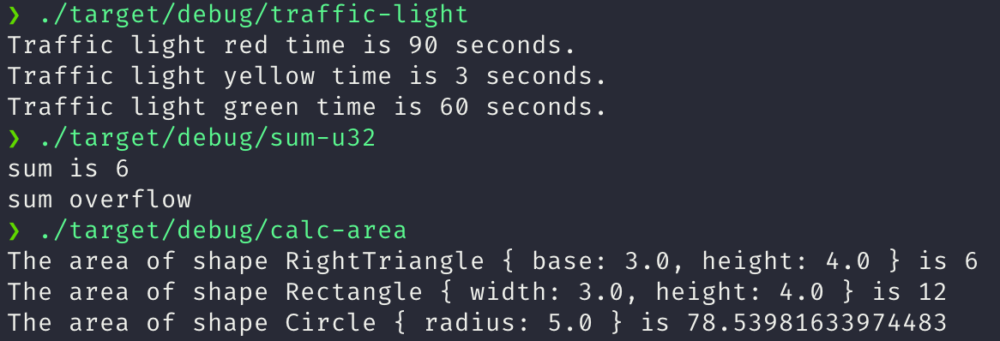

# solution04

## quiz01

为枚举交通信号灯实现一个 trait, trait 里包含一个返回时间的方法，不同的灯持续的时间不同，可以上传代码片段，或者代码的链接。

[traffic-light](traffic-light/)

## quiz02

实现一个函数，为 u32 类型的整数集合求和，参数类型为 &[u32]，返回类型为 Option＜u32＞，溢出时返回 None，可以上传代码片段，或者代码的链接。

[sum-u32](sum-u32/)

## quiz03

实现一个打印图形面积的函数，它接收一个可以计算面积的类型作为参数，比如圆形，三角形，正方形，需要用到泛型和泛型约束，可以上传代码片段，或者代码的链接。

[calc-area](calc-area/)

## 运行结果

